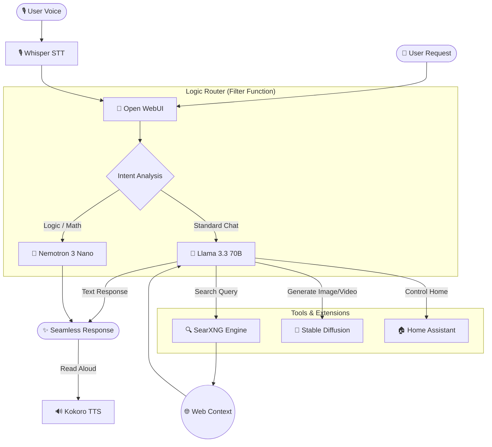

# 🌌 AI Sandbox: XiP AI Orchestration 🤖

## 🛡️ Public Release Security Notice
This repository has been sanitized for public release. 
- All **IP Addresses** have been replaced with placeholders like `<HOST-IP>` and `<VM-IP>`.
- All **Secrets** and **Keys** have been replaced with `<YOUR_SECRET_HERE>`.
- All **Domains** have been replaced with `<YOUR-DOMAIN.COM>`.

> [!IMPORTANT]
> To deploy this, you MUST search for all `<...>` tags and replace them with your local environment values. 
> This repository uses **SOPS** with **Age** to protect secrets. Decrypt them before applying to the cluster:
> ```powershell
> # Decrypt and apply in one go
> sops -d k3s/librechat/librechat-secrets.enc.yaml | kubectl apply -f -
> sops -d k3s/searxng/searxng-secrets.enc.yaml | kubectl apply -f -
> ```

> [!WARNING]
> **AI Execution Risks & Autonomous Actions**
> The orchestration tools and Python proxies within this repository provide Large Language Models (LLMs) with direct execution access to local APIs, rendering pipelines, and file systems.
> AI models can and will make mistakes, hallucinate commands, or interpret requests unpredictably. 
> - **NEVER** grant an AI agent unrestricted permission to delete or overwrite production state.
> - **ALWAYS** review the Python execution logic before applying Custom Tools to your Open WebUI or LibreChat environments. 
> - **ISOLATE** the AI Sandbox using strict Zero-Trust NetworkPolicies to prevent lateral movement across your network in the event of an unintended Agentic hallucination.

---
This repository contains the application-layer configuration for the **XiP AI** experience. It orchestrates a suite of state-of-the-art AI models and tools, delivering a high-performance, secure, and fully local alternative to commercial AI platforms.

Powered by a **32GB VRAM RTX 5090** and a **16GB RAM / 8-vCPU VM**, this stack provides real-time vision, agentic model routing, and smart home integration while maintaining 100% data privacy.

---

## 1. AI Software Architecture & Request Routing 🏗️
The system is designed as an **Agentic Hub** that utilizes specialized models based on the nature of the user's request.

### 1.1 Intelligence Tiers
| Capability | Model | Execution Path | Role |
| :--- | :--- | :--- | :--- |
| **Core Intelligence** | Llama 3.3 (70B Q4) | Host (Ollama / 100% GPU) | Primary reasoning & creative chat. |
| **Logic & Math** | Nemotron 3 Nano (4B) | Host (Ollama / 100% GPU) | Routed for high-precision calculations. |
| **Vision (Images)** | Qwen2.5-VL (Native) | Host (Ollama / 100% GPU) | Visual understanding and OCR. |
| **Image Generation** | Stable Diffusion XL | Host (SD-Forge / 100% GPU) | Inline generation via Forge API. |
| **Video Generation** | AnimateDiff & SVD | Host (SD-Forge / 100% GPU) | 100% Local high-fidelity video synthesis. |
| **Knowledge (RAG)** | nomic-embed-text | Host (Ollama / 100% GPU) | Vector embeddings for long-term memory. |
| **Voice Synthesis** | Kokoro-82M (TTS) | Cluster (GPU-Acceleration) | Sub-second high-fidelity speech. |
| **Voice Transcription** | Whisper (STT) | Cluster (CPU-Optimized) | Local, private speech-to-text. |

### 1.2 Agentic Routing Flow (The "XiP AI" Experience) 🛰️
Requests are automatically analyzed and dispatched to the most capable model or tool.



### 1.3 Automated Intelligence Updates ⚡
Your models are never stale. A Windows Scheduled Task on the host machine ensures the intelligence core is updated daily.
- **Schedule**: Daily at 3:00 AM.
- **Script**: `scripts/update-models.ps1` (Handles Ollama, SDXL, and SVD models).
- **Audit**: `scripts/update-log.txt`.

---

## 2. Infrastructure Overview 🧩
The sandbox runs in a hybrid configuration to maximize the **RTX 5090**'s performance.

*   **Host-Side Performance**: Ollama and Stable Diffusion run directly on the Windows host to access 100% of the GPU VRAM.
*   **Cluster-Side Stability**: Open WebUI, SearXNG, Home Assistant, and Databases run on K3s for high availability and integrated networking.

### 2.1 Networking & Security
- **Namespace**: `ai-sandbox`
- **mTLS**: Enforced via Istio Service Mesh.
- **RBAC**: Namespace-level restrictions allowing only authenticated traffic from `istio-system`.
- **Identity**: Single Sign-On (SSO) integrated via Keycloak.

---

## 3. Deployment Components 📂
| Module | Directory | Purpose |
| :--- | :--- | :--- |
| **Open WebUI** | `k3s/open-webui/` | Primary "XiP AI" interface. |
| **Voice (TTS)** | `k3s/kokoro/` | Kokoro Audio synthesis service. |
| **Voice (STT)** | `k3s/whisper/` | Whisper Audio transcription service. |
| **SearXNG** | `k3s/searxng/` | Local, private search engine. |
| **Home Assistant** | `k3s/home-assistant/` | Smart Home control bridge. |
| **Ollama Bridge** | `k3s/ollama-bridge/` | Connectivity between cluster and host AI. |
| **SD Forge (Host)** | `D:\Program Files\stable-diffusion\` | High-performance image/video hub. |
| **Scripts** | `scripts/` | Host-side automation & Codebase ingestion. |
| **Data** | `data/` | Codebase digests & model storage. |
| **AI RBAC** | `k3s/ai-rbac/` | NetworkPolicies and security controls. |

### 3.1 Open WebUI Integration Tools
- **Text-to-Image Generator**: A custom Python proxy that bridges Open WebUI directly to the SD Forge Host API (`<HOST-IP>:7860`), triggering high-fidelity dual-pass `sd_xl_base` generations inline via the chat. The source code is permanently versioned at `k3s/stable-diffusion/open_webui_sd_image_tool.py`.
- **Text-to-Video Generator**: A custom Python component deployed within the Open WebUI workspace. It connects to the Forge Host API (`<HOST-IP>:8188`) to seamlessly dispatch video generation prompts and notify the user of local payload URLs securely outside the CSP matrix. The source code is permanently versioned at `k3s/stable-diffusion/open_webui_sd_video_tool.py`.

---

## 4. Maintenance & Scaling ⚓
### Pulling Models
To update the intelligence core, run the following on the host:
```powershell
ollama pull llama3.3:70b-instruct-q4_K_M
ollama pull qwen2.5-vl:latest
ollama pull nemotron-mini:4b
```

### Resource Optimization
- **Parallelism**: `OLLAMA_NUM_PARALLEL=4` (Host)
- **Concurrency**: `OLLAMA_MAX_LOADED_MODELS=4` (Host)
- **VRAM Buffer**: GPU-P is enabled for the cluster node (~8GB) to handle background MeiliSearch/Sidecar acceleration.

---

## 5. Data Sovereignty & Persistence 💾

All critical AI data resides outside the cluster for maximum durability and visibility.
- **Location**: `D:\AI_Data\` on the Windows host.
- **Mapped Volumes**: K3s uses `hostPath` mounts to ensure chat history (MongoDB) and Knowledge Bases (Open WebUI) are stored on physical disk.
- **SD Sovereignty**: All Stable Diffusion models (`models/`), outputs (`outputs/`), and embeddings are junctioned to `D:\AI_Data\stable-diffusion\` to ensure 100% persistence and manual access.
- **Backup**: Simply backup the `D:\AI_Data` folder to preserve the AI's entire "memory," including every image and video generated.

---

## 6. Deployment Instructions 🚀

To completely recreate this AI environment from scratch, your infrastructure must first be provisioned using the `k3slab` repository. Once the cluster is active, deploy the AI payloads logically:

### Step 1: Secure the Environment
First, apply the AI network policies and RBAC restrictions to prepare the `ai-sandbox` namespace.
```bash
# Deploys Zero-Trust boundaries and Service Accounts
kubectl apply -f k3s/ai-rbac/
```

### Step 2: Establish the Hardware Bridge
Connect the K3s environment to your Windows bare-metal host's GPUs. Ensure Ollama is running on the host.
```bash
# Deploys the headless endpoint and network policy
kubectl apply -f k3s/ollama-bridge/
```

### Step 3: Deploy the Core AI Workloads
Finally, deploy the front-end user interfaces and supporting microservices sequentially. Make sure to decrypt any SOPS secrets beforehand (e.g., SearXNG keys).
```bash
# Apply Search and Memory
sops -d k3s/searxng/searxng-secrets.enc.yaml | kubectl apply -f -
kubectl apply -k k3s/searxng/
kubectl apply -k k3s/meilisearch/

# Apply Voice Services
kubectl apply -k k3s/whisper/
kubectl apply -k k3s/kokoro/

# Apply Primary User Interface
kubectl apply -k k3s/open-webui/
```

### Step 4: Verify the Integrations
Navigate to your Open WebUI ingress (e.g., `chat.<YOUR-DOMAIN.COM>`), log in via SSO, and navigate to **Workspace > Tools** to import both `open_webui_sd_image_tool.py` and `open_webui_sd_video_tool.py` to finalize your offline visual generation pipeline!
